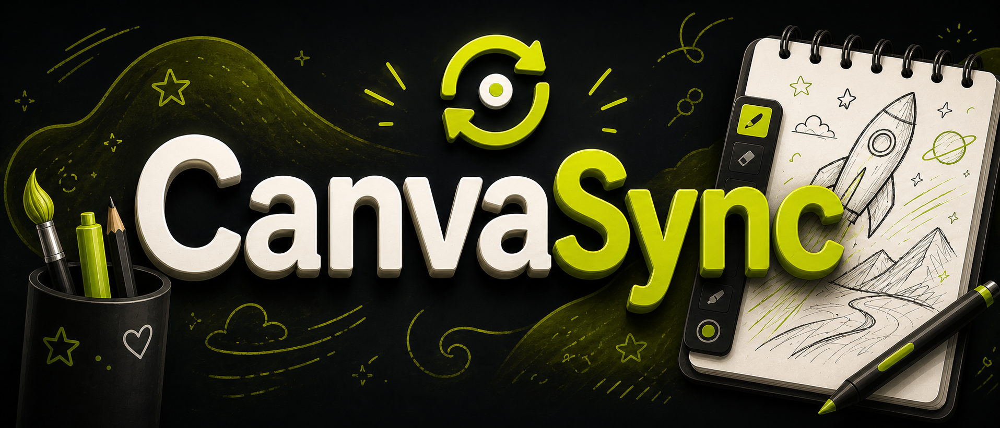
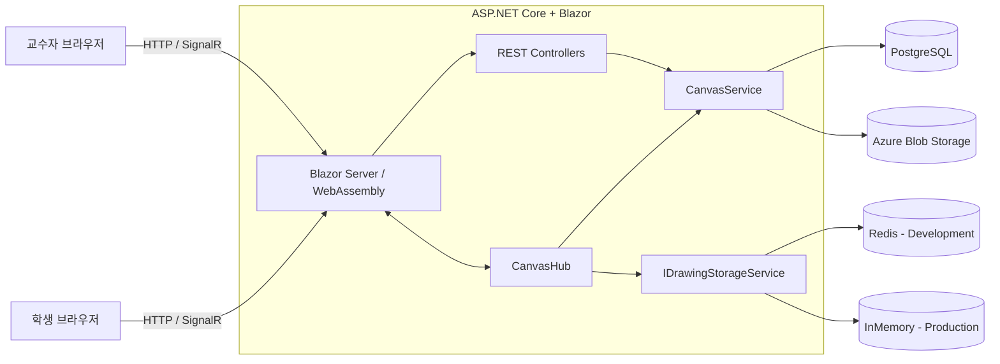

<div align="center">



# CanvaSync

### 교수자의 PDF 필기를 학생들에게 실시간으로 동기화하는 웹 기반 협업 필기 도구

<p>
  
  
  
  
  
  
</p>

CanvaSync는 학생들이 판서를 옮겨 적느라 수업 내용을 놓치는 문제를 줄이기 위해 만든 졸업작품입니다. 교수자가 PDF 위에 도형, 텍스트, 펜 필기를 추가하면 같은 강의방에 접속한 학생 화면에 변경 내용이 실시간으로 반영됩니다. 학생은 교수자의 필기와 별개로 자신의 개인 필기를 작성하고, 두 필기를 합친 PDF를 내려받을 수 있습니다.

</div>

---

## 주요 기능

- PDF 업로드 및 강의별 6자리 입장 코드 생성
- 강의방 단위 교수자 필기 실시간 동기화
- 사각형, 원, 선, 텍스트, 자유곡선 필기
- 색상, 채우기, 두께, 투명도 및 크기 조절
- 교수자 필기와 학생 개인 필기의 분리 관리
- 페이지별 미리보기와 필기 썸네일 갱신
- 개인 필기를 포함한 PDF 생성 및 다운로드
- 쿠키 기반 로그인과 내 강의/참여 강의 관리
- 실시간 필기 캐시와 PostgreSQL 영속 데이터 분리
- Azure Blob Storage를 이용한 PDF 원본 관리

## 사용 흐름

1. 교수자가 로그인한 뒤 PDF를 업로드합니다.
2. CanvaSync가 강의와 6자리 입장 코드를 생성합니다.
3. 학생이 입장 코드를 입력해 강의방에 참여합니다.
4. 교수자의 필기 작업이 SignalR을 통해 같은 강의방의 학생들에게 전달됩니다.
5. 학생은 교수자 필기 위에 자신의 개인 필기를 추가할 수 있습니다.
6. 교수자 필기와 개인 필기를 합친 PDF를 내려받습니다.

## 시스템 구성



현재 개발 환경에서는 Redis를, 배포 환경에서는 InMemory 저장소를 사용합니다. 두 구현은 `IDrawingStorageService` 뒤에 분리되어 있으며, 운영 환경의 영속성 및 다중 인스턴스 확장은 향후 개선 항목입니다.

## 실시간 필기 동기화

CanvaSync는 완성된 화면 이미지를 매번 전달하지 않고, 필기 요소의 변경 작업을 이벤트로 전송합니다.

```text
교수자 입력
  → Factor를 FactorDto로 변환
  → Add / Update / Delete / End 이벤트 전송
  → CanvasHub가 강의방 그룹에 브로드캐스트
  → 학생 클라이언트가 해당 페이지의 필기 상태에 반영
  → 썸네일과 Canvas 다시 렌더링
```

주요 이벤트는 다음과 같습니다.

| 이벤트 | 의미 |
| --- | --- |
| `Add` | 새로운 도형, 텍스트 또는 펜 요소 추가 |
| `Update` | 드래그, 크기 변경, 펜 입력 중 상태 갱신 |
| `End` | 하나의 편집 작업 완료 |
| `Delete` | 기존 필기 요소 삭제 |

- SignalR 그룹을 `lecture:{lectureId}` 형식으로 분리해 강의방별로 이벤트를 전달합니다.
- MessagePack 프로토콜을 사용해 SignalR 메시지를 직렬화합니다.
- 같은 페이지에 대한 서버 내 동시 변경은 페이지별 `SemaphoreSlim`으로 직렬화합니다.
- 교수자 연결이 종료되면 현재 필기 상태를 PostgreSQL에 저장하고 캐시에 만료 시간을 설정합니다.

## 데이터 저장 구조

| 데이터 | 저장 위치 | 용도 |
| --- | --- | --- |
| 회원 및 강의 정보 | PostgreSQL | 계정, 강의, 참여 관계 관리 |
| 저장된 필기 | PostgreSQL `jsonb` | 사용자·강의별 필기 영속화 |
| 진행 중인 필기 | Redis 또는 InMemory | 실시간 조회 및 변경 반영 |
| PDF 원본 | Azure Blob Storage | PDF 업로드, 다운로드 및 삭제 |

PDF 원본과 필기 데이터를 분리해 저장하고, 다운로드 시 서버가 원본 PDF와 필기 오버레이를 합성합니다.

PostgreSQL 스키마에는 `Members.Name`, `Lectures.Code`, `DrawingData(LectureId, MemberId)` unique index와 `DrawingData` foreign key를 두어 로그인 이름, 강의 입장 코드, 사용자별 필기 스냅샷의 무결성을 DB 레벨에서 보장합니다. 주요 조회 쿼리와 `EXPLAIN` 확인 방법은 [`docs/database-design-and-tuning.md`](docs/database-design-and-tuning.md)에 정리했습니다.

## 기술 스택

| 영역 | 기술 |
| --- | --- |
| Frontend | Blazor WebAssembly, Blazor Server, Razor Components |
| Drawing | SkiaSharp, SkiaSharp.Views.Blazor |
| Realtime | ASP.NET Core SignalR, MessagePack |
| Backend | ASP.NET Core 9, Entity Framework Core 9 |
| Database | PostgreSQL, Npgsql, JSONB |
| Cache | Redis, ConcurrentDictionary 기반 InMemory 저장소 |
| File Storage | Azure Blob Storage |
| PDF | PDFtoImage, PDFsharp |
| Authentication | Cookie Authentication, BCrypt |

## 프로젝트 구조

```text
canvasync/
├── canvasync/                  # ASP.NET Core 서버 및 Blazor Server UI
│   ├── Components/             # 로그인, 강의 생성/참여, 마이페이지
│   ├── Controllers/            # 강의, 필기, PDF API
│   ├── Data/                   # EF Core DbContext
│   ├── Hubs/                   # SignalR CanvasHub
│   ├── Migrations/             # PostgreSQL 마이그레이션
│   └── Services/               # 필기 저장소, PDF/Blob 서비스
├── canvasync.Client/           # Blazor WebAssembly 필기 클라이언트
│   ├── Pages/Drawing.razor     # Canvas 렌더링 및 실시간 동기화
│   └── Services/               # HTTP API 클라이언트
├── canvasync.Library/          # 공유 모델, DTO, 서비스 인터페이스
└── canvasync.sln
```

## 로컬 실행

### 요구 사항

- [.NET 9 SDK](https://dotnet.microsoft.com/download/dotnet/9.0)
- PostgreSQL
- Redis
- Azure Storage 계정 또는 [Azurite](https://learn.microsoft.com/azure/storage/common/storage-use-azurite)

### 1. 저장소 복제

```bash
git clone <repository-url>
cd canvasync
```

### 2. 로컬 인프라 준비

Docker를 사용한다면 다음과 같이 PostgreSQL과 Redis를 실행할 수 있습니다.

```bash
docker run --name canvasync-postgres \
  -e POSTGRES_DB=canvasync \
  -e POSTGRES_USER=canvasync \
  -e POSTGRES_PASSWORD=canvasync \
  -p 5432:5432 \
  -d postgres:16-alpine

docker run --name canvasync-redis \
  -p 6379:6379 \
  -d redis:7-alpine
```

Azurite를 사용할 경우 기본 Blob 포트는 `10000`입니다.

```bash
docker run --name canvasync-azurite \
  -p 10000:10000 \
  -d mcr.microsoft.com/azure-storage/azurite \
  azurite-blob --blobHost 0.0.0.0
```

### 3. 개발 설정 등록

연결 문자열은 저장소에 직접 작성하지 않고 .NET User Secrets 또는 환경 변수로 관리하는 것을 권장합니다.

```bash
dotnet user-secrets set \
  "ConnectionStrings:DefaultConnection" \
  "Host=localhost;Port=5432;Database=canvasync;Username=canvasync;Password=canvasync" \
  --project canvasync/canvasync.csproj

dotnet user-secrets set \
  "ConnectionStrings:Redis" \
  "localhost:6379" \
  --project canvasync/canvasync.csproj

dotnet user-secrets set \
  "ConnectionStrings:AzureStorage" \
  "UseDevelopmentStorage=true" \
  --project canvasync/canvasync.csproj

dotnet user-secrets set \
  "AzureStorage:PdfContainerName" \
  "lecture-pdfs" \
  --project canvasync/canvasync.csproj
```

실제 Azure Storage를 사용한다면 `ConnectionStrings:AzureStorage`를 해당 계정의 연결 문자열로 교체합니다.

### 4. 애플리케이션 실행

```bash
dotnet restore canvasync.sln
dotnet run --project canvasync/canvasync.csproj --launch-profile https
```

실행 후 `https://localhost:7257`로 접속합니다. 애플리케이션 시작 시 EF Core 마이그레이션이 자동으로 적용됩니다.

## 핵심 코드

- [`CanvasHub`](canvasync/Hubs/CanvasHub.cs): 강의방 연결, 이벤트 브로드캐스트, 실시간 필기 상태 반영
- [`Drawing.razor`](canvasync.Client/Pages/Drawing.razor): PDF 렌더링, 필기 도구, SignalR 송수신
- [`CanvasService`](canvasync/Services/CanvasService.cs): 강의 및 필기 영속 데이터 관리
- [`IDrawingStorageService`](canvasync/Services/IDrawingStorageService.cs): 실시간 필기 저장소 추상화
- [`RedisDrawingStorageService`](canvasync/Services/RedisDrawingStorageService.cs): Redis 기반 구현
- [`InMemoryDrawingStorageService`](canvasync/Services/InMemoryDrawingStorageService.cs): 단일 프로세스 메모리 기반 구현
- [`AzureBlobPdfStorageService`](canvasync/Services/AzureBlobPdfStorageService.cs): PDF 원본 업로드, 다운로드, 삭제
- [`PDFDownloadController`](canvasync/Controllers/PDFImagesController.cs): PDF와 필기 오버레이 합성

## 개발 상태 및 개선 계획

CanvaSync는 졸업작품과 기술 검증을 목적으로 개발 중이며, 현재 상태를 상용 서비스 수준으로 간주하지 않습니다.

- [ ] SignalR Hub 인증 및 강의별 교수자/학생 권한 검증
- [ ] 필기 요소 ID, 이벤트 순서 번호 및 문서 Revision 도입
- [ ] 재접속 시 누락 이벤트 복구와 최종 상태 수렴 보장
- [ ] 마우스 이동 이벤트 제한 및 부분 업데이트를 통한 저장 비용 개선
- [ ] 개발/배포 환경의 저장소 동작 통일
- [ ] Azure SignalR Service 또는 Redis backplane을 이용한 다중 인스턴스 구성
- [ ] 단위·통합 테스트와 자동화된 CI 추가
- [ ] 다중 학생 시뮬레이션과 지연 시간·처리량·자원 사용량 측정
- [ ] 구조화된 로깅, 메트릭 및 장애 복구 검증

## 프로젝트에서 다룬 문제

- 다수 사용자가 같은 문서를 볼 때 변경 사항을 강의방 단위로 전달하는 방법
- 실시간 상태와 영속 상태의 저장 수명 주기를 분리하는 방법
- 자유곡선과 도형 데이터를 네트워크 전송 가능한 DTO로 변환하는 방법
- PDF 원본, 교수자 필기, 학생 개인 필기를 독립적으로 관리하고 다시 합성하는 방법
- 동일 페이지에 대한 동시 변경이 서버 메모리 상태를 손상시키지 않도록 제어하는 방법

---

CanvaSync는 완성된 기능 수보다 **실시간 이벤트 전달, 상태 동기화, 캐시와 DB의 역할 분리, 장애 상황에서의 데이터 수명 주기**를 직접 설계하고 개선하는 데 초점을 둔 프로젝트입니다.
