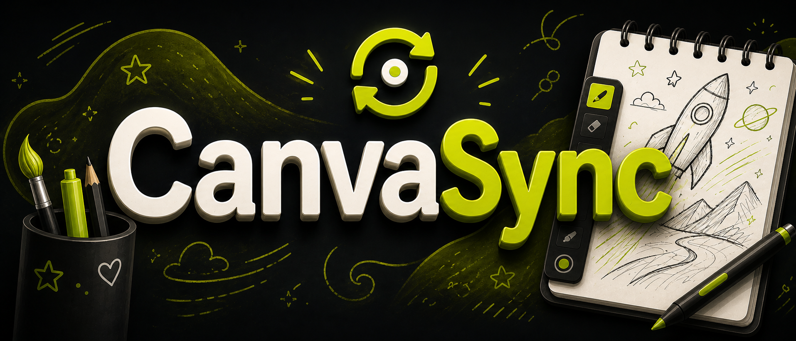

# CanvaSync

### 교수자의 PDF 필기를 학생들에게 실시간으로 전달하는 협업 필기 도구

수업 중 판서를 옮겨 적느라 설명을 놓치는 문제를 줄이기 위해 만든 졸업작품입니다. 
교수자의 필기를 함께 보면서도, 학생은 자신의 필기를 별도로 남기고 하나의 PDF로 저장할 수 있습니다.

  
  
  
  
  
  

---

## 🎓 프로젝트 소개

CanvaSync는 교수자와 학생이 같은 PDF를 보며 수업 내용을 공유하는 웹 기반 필기 서비스입니다. 교수자가 PDF 위에 추가한 필기는 같은 강의방의 학생 화면에 실시간으로 나타나며, 학생은 그 위에 자신만의 메모를 더할 수 있습니다.

실시간 수업이 끝난 뒤에도 강의와 필기 기록을 다시 확인할 수 있습니다. 필요한 경우 교수자의 판서와 개인 필기를 원본 PDF에 합쳐 하나의 학습 자료로 내려받을 수 있습니다.

---

## 🚀 사용 흐름

### 1. 강의 만들기

교수자가 로그인한 뒤 수업에 사용할 PDF를 업로드합니다. 강의가 만들어지면 학생들에게 공유할 수 있는 6자리 입장 코드가 함께 생성됩니다.

### 2. 입장 코드로 참여하기

학생은 전달받은 코드를 입력해 강의방에 참여합니다. 복잡한 초대 과정 없이 코드만으로 필요한 강의를 찾고 바로 수업 화면에 들어갈 수 있습니다.

### 3. 실시간으로 수업 듣기

교수자가 PDF 위에 도형, 텍스트, 펜 필기를 추가하면 학생 화면에도 곧바로 반영됩니다. 학생은 교수자의 판서를 그대로 보면서 별도의 개인 필기를 자유롭게 작성할 수 있습니다.

### 4. 하나의 PDF로 저장하기

수업이 끝나면 원본 자료와 교수자 필기, 자신의 개인 필기를 합친 PDF를 내려받을 수 있습니다. 수업 중 작성한 내용을 별도로 옮겨 적지 않아도 그대로 학습 자료로 활용할 수 있습니다.

---

## ✨ 주요 특징

### 🔄 교수자 필기 실시간 동기화

완성된 화면 전체를 반복해서 보내는 대신, 새로 그리거나 수정한 필기 요소만 같은 강의방에 전달합니다. 강의방마다 실시간 연결을 분리해 다른 수업의 데이터가 섞이지 않도록 했습니다. 교수자의 입력과 학생 화면의 갱신이 자연스럽게 이어지도록 페이지 미리보기와 필기 화면도 함께 업데이트합니다.

### ✍️ PDF 위에서 바로 필기

사각형, 원, 선, 텍스트, 자유곡선을 사용해 PDF 위에 직접 필기할 수 있습니다. 색상과 채우기, 선 두께, 투명도, 크기도 상황에 맞게 조절할 수 있습니다. 여러 페이지를 오갈 때는 미리보기를 통해 필요한 내용을 빠르게 찾을 수 있습니다.

### 🗂️ 공유 필기와 개인 필기 분리

교수자의 판서는 모든 학생에게 공유되지만, 학생이 작성한 메모는 개인 데이터로 따로 관리됩니다. 덕분에 같은 수업 자료를 보면서도 각자 필요한 내용을 자유롭게 덧붙일 수 있습니다. 저장하거나 PDF로 내보낼 때만 두 필기를 하나의 결과물로 합칩니다.

### 🧑‍🏫 입장 코드 중심의 강의 관리

교수자는 PDF를 업로드해 강의를 만들고, 학생은 6자리 코드로 참여합니다. 로그인 후에는 자신이 만든 강의와 참여 중인 강의를 한곳에서 다시 확인할 수 있습니다. 실제 강의 구성원인지 확인한 뒤 실시간 연결을 허용해 강의별 접근 범위도 구분했습니다.

### 📄 필기까지 담은 PDF 내보내기

PDF 원본은 필기 데이터와 분리해 보관하고, 다운로드할 때 필요한 필기를 원본 위에 다시 그려 넣습니다. 교수자의 판서와 학생의 개인 필기를 함께 담을 수 있어 수업 화면에서 본 결과를 그대로 저장할 수 있습니다. 원본 파일을 매번 복제하지 않아도 사용자마다 다른 결과물을 만들 수 있습니다.

### 💾 진행 중인 수업과 저장된 기록 관리

수업 중 자주 바뀌는 필기는 빠르게 읽고 쓸 수 있는 임시 저장소에서 관리하고, 보관이 필요한 필기는 데이터베이스에 저장합니다. 교수자가 강의방을 나가면 현재 필기 상태를 저장해 갑작스러운 종료에도 기록이 남도록 했습니다. PDF 원본과 강의 정보, 진행 중인 필기의 역할을 나눠 각 데이터의 수명에 맞게 관리합니다.

---

## 🧩 시스템 구성

<!-- GitHub에 구조도 이미지를 업로드한 뒤 아래 URL을 교체해 추가하세요.

  

-->

교수자와 학생은 같은 웹 애플리케이션을 사용하며, 일반 요청과 실시간 필기 이벤트는 각각 API와 SignalR Hub가 처리합니다. 강의 정보와 저장된 필기, 진행 중인 필기, PDF 원본은 성격에 맞는 저장소로 나누어 관리합니다.

---

### Thank You

